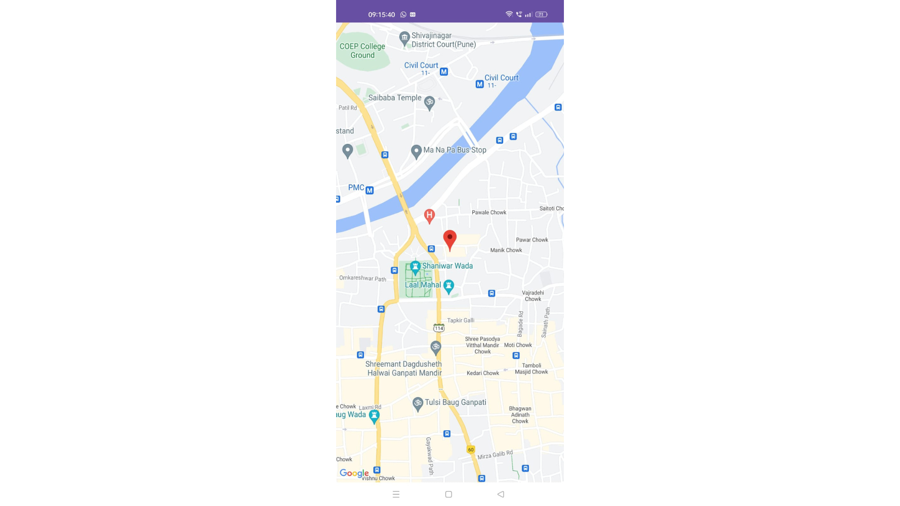
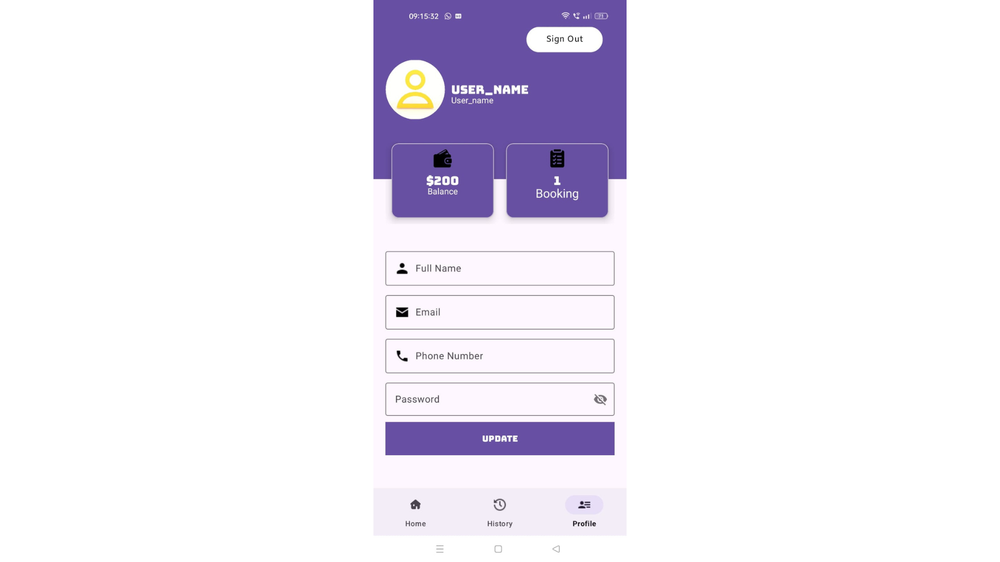

### AhenUser-Android

# Ahen User App

Welcome to the Ahen User App repository! This application serves as a user-side interface for booking driving school sessions, akin to an Uber for driving schools. Users can easily find and book the nearest driving school sessions according to their preferences.

## Features

- **Easy Booking:** Book driving school sessions with a few taps.
- **Location-Based Search:** Find the nearest driving schools.
- **User Profiles:** Manage your profile and session history.
- **Real-Time Updates:** Get real-time updates on your bookings and driving sessions.
- **Secure Payments:** Use Razorpay for secure and seamless payments.

## Technologies Used

- **Android Studio**
- **Java/Kotlin**
- **XML**
- **Firebase for Authentication and Database**
- **Google Maps API**
- **Razorpay for Payment Gateway**

## Installation

1. Clone the repository:
    ```bash
    git clone https://github.com/AnoopVL/AhenUser-Android.git
    ```
2. Open the project in Android Studio.
3. Build and run the project on your device or emulator.

## Usage

1. Sign up or log in with your account.
2. Search for driving schools near you.
3. Book a session that fits your schedule.
4. Attend your driving lesson and become a proficient driver!

## Contributing

We welcome contributions! Please fork the repository and submit pull requests.

## Contact

For any inquiries or feedback, please reach out to [AnoopVL](https://github.com/AnoopVL) or contact.anoopvl@gmail.com


## Screenshots






